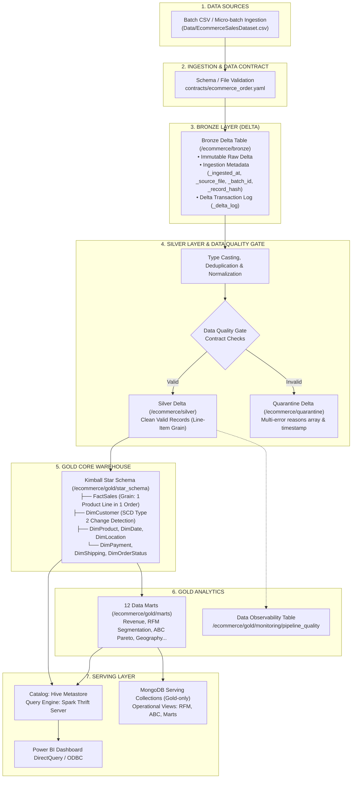

# 🌐 GlobalCart Lakehouse Analytics Platform

### 🚀 Production-Oriented PySpark & Delta Lake Medallion Pipeline | Kimball Star Schema | SCD Type 2 | Data Reconciliation & Serving

`Apache Spark` · `Delta Lake` · `Hadoop HDFS` · `Hive Metastore` · `MongoDB` · `Power BI` · `Python` · `Pytest` · `YAML Data Contracts`

**GlobalCart Lakehouse Analytics Platform** là một dự án **production-oriented data engineering portfolio** hoàn chỉnh, hiện thực hóa kiến trúc nền tảng dữ liệu hiện đại (**Modern Data Lakehouse Architecture**) phục vụ xử lý giao dịch thương mại điện tử đa quốc gia. Hệ thống xử lý dữ liệu từ nguồn batch & micro-batch, nạp qua mô hình **Medallion Lakehouse (Bronze - Silver - Gold)** với cơ chế kiểm soát chất lượng **Data Quality Gate & Multi-Error Quarantine Table**, mô hình hóa dữ liệu kho theo **Kimball Star Schema (1 Fact, 7 Dimensions, SCD Type 2)**, tạo **12 Data Marts** phân tích chuyên sâu (RFM Segmentation, Pareto ABC) và cung cấp tầng serving đồng nhất cho **Power BI** (qua Hive Thrift Server) và **MongoDB** (Gold-only Operational Serving).

---

## 📑 Mục Lục Hệ Thống (Table of Contents)

1. [Business Problem & Mục Tiêu Nghiệp Vụ](#1-business-problem--mục-tiêu-nghiệp-vụ)
2. [Sơ Đồ Kiến Trúc Hệ Thống (System Architecture)](#2-sơ-đồ-kiến-trúc-hệ-thống-system-architecture)
3. [Nguồn Dữ Liệu & Định Nghĩa Grain (Source & Data Grain)](#3-nguồn-dữ-liệu--định-nghĩa-grain-source--data-grain)
4. [Kiến Trúc Pipeline Medallion Canonical](#4-kiến-trúc-pipeline-medallion-canonical)
5. [Tầng Bronze (Ingestion Metadata & Delta Log)](#5-tầng-bronze-ingestion-metadata--delta-log)
6. [Tầng Silver & Data Contract Độc Lập](#6-tầng-silver--data-contract-độc-lập)
7. [Tầng Quarantine & Data Observability](#7-tầng-quarantine--data-observability)
8. [Tầng Gold Core: Mô Hình Kimball Star Schema](#8-tầng-gold-core-mô-hình-kimball-star-schema)
9. [Xử Lý Chiều Biến Đổi Chậm SCD Type 2 Chuẩn Xác](#9-xử-lý-chiều-biến-đổi-chậm-scd-type-2-chuẩn-xác)
10. [Tầng Gold Analytics: 12 Data Marts Nghiệp Vụ](#10-tầng-gold-analytics-12-data-marts-nghiệp-vụ)
11. [Quy Trình Xử Lý: Bootstrap vs Incremental Pipeline](#11-quy-trình-xử-lý-bootstrap-vs-incremental-pipeline)
12. [Tầng Phục Vụ Dữ Liệu (Serving Layer Architecture)](#12-tầng-phục-vụ-dữ-liệu-serving-layer-architecture)
13. [Ánh Xạ Semantic Layer Sang Power BI Dashboard](#13-ánh-xạ-semantic-layer-sang-power-bi-dashboard)
14. [Đối Soát & Bất Biến Dữ Liệu (Data Reconciliation)](#14-đối-soát--bất-biến-dữ-liệu-data-reconciliation)
15. [Bộ Kiểm Thử Tự Động (Automated Testing Suite)](#15-bộ-kiểm-thử-tự-động-automated-testing-suite)
16. [Đánh Giá Hiệu Năng & Khả Năng Mở Rộng (Scalability Benchmark)](#16-đánh-giá-hiệu-năng--khả-năng-mở-rộng-scalability-benchmark)
17. [Sổ Tay Vận Hành CLI (Command Line Operations)](#17-sổ-tay-vận-hành-cli-command-line-operations)
18. [Cấu Trúc Thư Mục Dự Án (Project Structure)](#18-cấu-trúc-thư-mục-dự-án-project-structure)
19. [Giới Hạn Hiện Tại & Lộ Trình Phát Triển (Strategic Roadmap)](#19-giới-hạn-hiện-tại--lộ-trình-phát-triển-strategic-roadmap)

---

## 1. Business Problem & Mục Tiêu Nghiệp Vụ

Trong môi trường thương mại điện tử toàn cầu quy mô lớn, các tổ chức thường đối mặt với 5 thách thức cốt lõi:
- **Dữ liệu thô phân tán và thiếu tính toàn vẹn:** Đơn hàng từ nhiều thị trường gặp lỗi âm đơn giá, chiết khấu vượt mức $100\%$, thiếu mã đơn, thời gian giao hàng không hợp lý.
- **Rủi ro nhân đôi doanh thu khi khách hàng đổi thông tin:** Khi thuộc tính nhân khẩu học (Phân khúc, Vùng) thay đổi, join dimension thông thường làm nhân bản dòng Fact bán hàng.
- **Bất đồng bộ số liệu giữa BI và ứng dụng vận hành:** Báo cáo Power BI hiển thị một số, trong khi MongoDB phục vụ microservice hiển thị số khác nếu truy vấn trực tiếp từ các tầng chưa chuẩn hóa.
- **Khó khăn trong truy vết và audit lỗi:** Khi phát hiện số liệu sai, đội ngũ kỹ sư dữ liệu không thể xác định bản ghi đến từ batch nào, file nào và vi phạm những luật nghiệp vụ nào.
- **Chi phí điện toán cao khi phải re-run toàn bộ:** Cần một pipeline hỗ trợ nạp tăng tiến (**Incremental Ingestion**) và hợp nhất dữ liệu (**Delta MERGE INTO**) thay vì batch overwrite định kỳ.

**Mục tiêu của GlobalCart:** Xây dựng một Lakehouse Platform khép kín, phân tách rành mạch trách nhiệm từng tầng dữ liệu, áp dụng kiểm định chất lượng theo hợp đồng (**Data Contract**), duy trì nguồn chân lý duy nhất (**Single Source of Truth** từ Gold Core) và bảo đảm tính bất biến số liệu (**Data Reconciliation**).

---

## 2. Sơ Đồ Kiến Trúc Hệ Thống (System Architecture)

Kiến trúc chuẩn hóa canonical duy nhất xuất hiện xuyên suốt nền tảng:



---

## 3. Nguồn Dữ Liệu & Định Nghĩa Grain (Source & Data Grain)

### Định Nghĩa Grain Chính Thức
Một trong những nguyên tắc quan trọng nhất của kỹ sư dữ liệu là định nghĩa rõ ràng **Grain (mức độ chi tiết)** của từng tầng dữ liệu để tránh tính trùng số liệu:

> [!IMPORTANT]
> **Quy Tắc Grain Toàn Hệ Thống:**
> - **Silver Grain:** Đúng **1 dòng sản phẩm trong 1 đơn hàng (1 product line item within 1 customer order)**.
> - **FactSales Grain:** Đúng **1 dòng sản phẩm trong 1 đơn hàng**, kết nối với 7 Dimensions qua Surrogate Keys.
> - **Cột `Order_Total_Revenue` trong Silver:** Thể hiện tổng doanh thu cả đơn hàng, được lặp lại trên từng line item để phục vụ truy vấn lọc theo đơn. **Cảnh báo:** Tuyệt đối không được tính `SUM(Order_Total_Revenue)` trực tiếp mà không deduplicate `Order_ID`.

### Các Trường Dữ Liệu Nguồn Cốt Lõi
- **Định danh nghiệp vụ:** `Order_ID` (Degenerate Dimension), `Customer_ID`, `Product_Name`.
- **Thời gian giao dịch:** `Order_Date` (yyyy-MM-dd), `Year`, `Month`.
- **Chỉ số đo lường (Measures):** `Quantity` (int > 0), `Unit_Price` (double >= 0), `Discount` (0..1), `Revenue` (double >= 0), `Cost`, `Profit`, `Shipping_Cost`, `Shipping_Days` (int >= 0).
- **Phân loại nghiệp vụ:** `Category`, `Sub_Category`, `Order_Status`, `Payment_Method`, `Shipping_Method`, `Region`, `Country`.

---

## 4. Kiến Trúc Pipeline Medallion Canonical

Hệ thống phân chia ranh giới vật lý và logic rõ ràng qua 4 tầng:

| Tầng Dữ Liệu | Công Nghệ Lưu Trữ | Vai Trò Kỹ Thuật | Đường Dẫn Mặc Định |
|---|---|---|---|
| **Landing / Source** | Local CSV / POSIX File | Nơi tiếp nhận file CSV thô ban đầu từ các nguồn micro-batch | `Data/EcommerceSalesDataset.csv` |
| **Bronze Layer** | Delta Lake (Append-only) | Đại diện số hóa dạng Delta của nguồn dữ liệu, lưu vết `_delta_log` và metadata | `/ecommerce/bronze/ecommerce_raw_delta` |
| **Silver Layer** | Delta Lake (ACID Table) | Dữ liệu sạch, chuẩn hóa kiểu, deduplicate, áp dụng Data Contract | `/ecommerce/silver/ecommerce_clean_delta` |
| **Quarantine** | Delta Lake (Error Log) | Phân lập toàn bộ bản ghi vi phạm hợp đồng dữ liệu kèm danh sách mã lỗi | `/ecommerce/quarantine/rejected_rows` |
| **Gold Core** | Delta Lake (Star Schema) | Kho dữ liệu chuẩn Kimball gồm 1 bảng Fact chi tiết và 7 bảng Dimension (SCD2) | `/ecommerce/gold/star_schema/*` |
| **Gold Marts** | Delta Lake (Data Marts) | 12 bảng tổng hợp phục vụ dashboard phân tích và ứng dụng vận hành | `/ecommerce/gold/marts/*` |
| **Monitoring** | Delta Lake (Observability) | Lưu vết số lượng dòng nạp, hợp lệ, bị reject và tỷ lệ lỗi qua từng đợt chạy | `/ecommerce/gold/monitoring/pipeline_quality` |

---

## 5. Tầng Bronze (Ingestion Metadata & Delta Log)

Khác biệt với việc chỉ copy file CSV sang định dạng Parquet thông thường, tầng Bronze của GlobalCart được nâng cấp để hỗ trợ **truy vết (traceability), dòng đời dữ liệu (lineage), khả năng phát lại (replay)** và **kiểm soát nạp tăng tiến**:

Mỗi bản ghi được bổ sung 5 trường siêu dữ liệu hệ thống:
- `_ingested_at`: Timestamp hệ thống chính xác tại thời điểm ghi vào Bronze Delta.
- `_source_file`: Tên URI file nguồn gốc ban đầu (sử dụng `input_file_name()`).
- `_batch_id`: Mã nhận diện batch chạy (`run_id` / `batch_id`).
- `_source_system`: Nguồn phát sinh dữ liệu (ví dụ: `ecommerce_csv`).
- `_record_hash`: Mã băm SHA-256 trên toàn bộ thuộc tính nghiệp vụ để kiểm tra toàn vẹn và chống trùng lặp.

Mọi giao dịch ghi vào Bronze đều được bảo vệ bởi **Delta Lake Transaction Log (`_delta_log`)**, hỗ trợ tính năng khôi phục và audit lịch sử giao dịch.

---

## 6. Tầng Silver & Data Contract Độc Lập

### Tách Biệt Data Contract Khỏi Logic Xử Lý
Toàn bộ quy chuẩn về kiểu dữ liệu, tính nullable và biên giá trị được cấu hình độc lập tại tệp [contracts/ecommerce_order.yaml](contracts/ecommerce_order.yaml):

```yaml
version: "1.0.0"
dataset: "ecommerce_order"
grain: "one product line item within one customer order"

columns:
  Order_ID: { type: "string", nullable: false }
  Quantity: { type: "integer", nullable: false, min: 1 }
  Unit_Price: { type: "double", nullable: false, min: 0.0 }
  Discount: { type: "double", nullable: false, min: 0.0, max: 1.0 }
  Revenue: { type: "double", nullable: false, min: 0.0 }
  Shipping_Days: { type: "integer", nullable: false, min: 0 }
  Order_Status:
    type: "string"
    allowed_values: ["Delivered", "Returned", "Cancelled", "Processing", "Shipped"]
```

### Pipeline Xử Lý Tại Tầng Silver
1. **Deduplication:** Loại bỏ các bản ghi trùng lặp ở tầng nguồn.
2. **Schema Casting:** Ép kiểu chính xác cho toàn bộ các trường số học, ngày tháng và chuỗi.
3. **Derived Metrics:**
   - `Net_Profit = Profit - Shipping_Cost`
   - `Delivery_Level`: Fast ($\le 3$ ngày), Normal ($4..7$ ngày), Slow ($> 7$ ngày).
   - `Order_Total_Revenue`: Tổng doanh thu theo từng `Order_ID` (kèm grain caveat).
4. **Data Quality Gate:** Đánh giá hợp lệ đồng thời điều kiện null và ràng buộc giá trị nghiệp vụ.

---

## 7. Tầng Quarantine & Data Observability

### Multi-Error Quarantine Tracking
Trong các kiến trúc cũ, việc dùng chuỗi `.when().when()` khiến bản ghi vi phạm nhiều lỗi cùng lúc (ví dụ vừa `Quantity <= 0` vừa `Discount > 1`) chỉ ghi nhận được lý do đầu tiên. 

Tầng Quarantine của GlobalCart theo dõi **đa lỗi vi phạm**:
- `rejection_reasons`: Danh sách mảng chuỗi `array<string>` ghi nhận toàn bộ các điều kiện bị vi phạm (ví dụ: `["INVALID_QUANTITY", "INVALID_DISCOUNT"]`).
- `rejection_reason`: Chuỗi nối phân tách bằng dấu chấm phẩy phục vụ hiển thị báo cáo tabular.
- `rejected_at`: Thời gian bị cách ly vào bảng Quarantine.

### Bảng Giám Sát Chất Lượng (`gold_monitoring.pipeline_quality`)
Mỗi lần pipeline thực thi, số liệu tổng quan về chất lượng được lưu tự động vào Delta table:
- `run_id`, `batch_id`, `raw_rows`, `valid_rows`, `rejected_rows`, `reject_rate_percent`, `recorded_at`.

Giúp kỹ sư dữ liệu thiết lập cảnh báo chủ động khi tỷ lệ reject vượt ngưỡng cho phép (SLA).

---

## 8. Tầng Gold Core: Mô Hình Kimball Star Schema

Tầng Gold Core được thiết kế theo chuẩn **Kimball Dimensional Modeling**:

```
                       DimDate
                          │
DimCustomer ────────── FactSales ────────── DimProduct
(SCD Type 2)              │
                     DimLocation
                          │
                     DimPayment
                          │
                     DimShipping
                          │
                   DimOrderStatus
```

### Chi Tiết 7 Bảng Dimension & 1 Bảng Fact:
1. **`FactSales`:** Grain: 1 dòng sản phẩm trong 1 đơn hàng.
   - Foreign Keys: `CustomerKey`, `ProductKey`, `DateKey`, `LocationKey`, `PaymentKey`, `ShippingKey`, `StatusKey`.
   - Degenerate Dimension: `Order_ID`.
   - Measures: `Unit_Price`, `Quantity`, `Discount`, `Revenue`, `Cost`, `Profit`, `Profit_Margin_Percent`, `Shipping_Cost`.
2. **`DimCustomer`:** Quản lý theo SCD Type 2 (`CustomerKey`, `Customer_ID`, `Customer_Gender`, `Customer_Segment`, `ValidFrom`, `ValidTo`, `Is_Current`).
3. **`DimProduct`:** `ProductKey`, `Product_Name`, `Category`, `Sub_Category`.
4. **`DimDate`:** `DateKey` (yyyyMMdd), `FullDate`, `Year`, `Month`, `Quarter`.
5. **`DimLocation`:** `LocationKey`, `Region`, `Country`.
6. **`DimPayment`:** `PaymentKey`, `Payment_Method`.
7. **`DimShipping`:** `ShippingKey`, `Shipping_Method`, `Delivery_Level`.
8. **`DimOrderStatus`:** `StatusKey`, `Order_Status`, `Is_Returned`, `Is_Cancelled`.

### Chiến Lược Khóa Đại Diện (Surrogate Key Strategy)
Thay vì sử dụng hàm sinh số không xác định như `monotonically_increasing_id()`, hệ thống sử dụng thuật toán sắp xếp theo khóa tự nhiên kết hợp `row_number().over(Window.orderBy(...))` để đảm bảo tính tái lập (reproducibility) trong các đợt build dimension.

---

## 9. Xử Lý Chiều Biến Đổi Chậm SCD Type 2 Chuẩn Xác

### Xử Lý Lỗi State Flip ($A \to B \to A$)
Nếu chỉ sử dụng `groupBy(Customer_ID, attributes)` để lấy `min(Order_Date)` làm `ValidFrom`, khi một khách hàng chuyển đổi trạng thái từ *Segment A* sang *Segment B* rồi sau đó quay trở lại *Segment A*, hai giai đoạn của Segment A sẽ bị gộp làm một, làm sai lệch lịch sử.

GlobalCart áp dụng giải thuật **Event-Ordered Change Detection**:
```
Giao dịch khách hàng sắp xếp theo ngày
                  ↓
       lag() trên các thuộc tính
                  ↓
      Phát hiện sự kiện thay đổi
(is_change = 1 nếu giá trị khác bản ghi trước)
                  ↓
   Cumulative sum gán change_group
                  ↓
      ValidFrom = min(Order_Date)
                  ↓
       lead(ValidFrom) → ValidTo
```

Kết quả tạo ra các khoảng thời gian nửa mở $[ValidFrom, ValidTo)$ liên tục, không chồng lấn, và bảo đảm đúng $1$ bản ghi hiện hành (`Is_Current = 1`) cho mỗi khách hàng.

---

## 10. Tầng Gold Analytics: 12 Data Marts Nghiệp Vụ

Tầng Gold Marts tổng hợp các lát cắt kinh doanh quan trọng:
1. `mart_overview`: Chỉ số điều hành tổng quan (Doanh thu, Lợi nhuận, Đơn hàng, Biên lợi nhuận trung bình).
2. `mart_revenue_by_region`: Doanh thu & lợi nhuận theo vùng địa lý.
3. `mart_revenue_by_country`: Doanh thu chi tiết theo từng quốc gia.
4. `mart_revenue_by_category`: Phân tích cơ cấu ngành hàng và nhóm sản phẩm.
5. `mart_top_products_by_revenue`: Top 10 sản phẩm đóng góp doanh thu lớn nhất.
6. `mart_payment_analysis`: Hiệu quả doanh thu theo phương thức thanh toán.
7. `mart_shipping_analysis`: Tốc độ giao hàng trung bình và chi phí vận chuyển.
8. `mart_order_status_analysis`: Tỷ lệ hoàn thành đơn, đơn hủy và đơn hoàn trả.
9. `mart_monthly_revenue`: Xu hướng tăng trưởng doanh thu theo chuỗi thời gian tháng.
10. `mart_customer_segment_analysis`: Giá trị đơn hàng trung bình (AOV) theo phân khúc khách hàng.
11. `mart_rfm_customer_segmentation`: Phân khúc khách hàng rule-based RFM (*Champions, Loyal, At-Risk, Casual*).
12. `mart_abc_product_analysis`: Phân tích Pareto ABC phân loại danh mục sản phẩm (Class A: top 80%, Class B: next 15%, Class C: tail 5%).

---

## 11. Quy Trình Xử Lý: Bootstrap vs Incremental Pipeline

Hệ thống phân tách rõ ràng 2 chế độ vận hành:

### 1. Bootstrap Pipeline (Full Refresh)
- **Mục đích:** Khởi tạo kho dữ liệu từ đầu hoặc nạp lại toàn bộ lịch sử.
- **Quy trình:**
  - Landing CSV $\to$ Ghi đè (`mode="overwrite"`) vào Bronze Delta kèm Ingestion Metadata.
  - Làm sạch Silver $\to$ Lưu đè vào Silver Delta và Quarantine Delta.
  - Rebuild toàn bộ 7 Dimensions và FactSales theo Star Schema.
  - Tính toán và đăng ký toàn bộ 12 Gold Data Marts.

### 2. Incremental Pipeline (Micro-batch & Upsert)
- **Mục đích:** Nạp dữ liệu định kỳ với thời gian xử lý và tài nguyên tối ưu.
- **Quy trình:**
  - Micro-batch CSV $\to$ Ghi tiếp (`mode="append"`) vào Bronze Delta.
  - Làm sạch batch mới qua Data Quality Gate.
  - **Delta MERGE INTO** tầng Silver theo khóa nghiệp vụ (`Order_ID + Product_Name`):
    - `whenMatchedUpdateAll()`
    - `whenNotMatchedInsertAll()`
  - Cập nhật Star Schema và làm mới các Data Marts liên quan.

---

## 12. Tầng Phục Vụ Dữ Liệu (Serving Layer Architecture)

### 1. Phục Vụ Báo Cáo BI (Power BI qua Spark Thrift Server & Hive Metastore)
- **Nguyên lý:** Tầng lưu trữ thực tế là các thư mục **Delta Lake**. Hive Metastore chỉ đóng vai trò **Data Catalog** (đăng ký metadata bảng và schema).
- **Truy vấn:** Power BI kết nối qua chuẩn **ODBC/JDBC** tới Spark Thrift Server, truy vấn trực tiếp bảng Delta đã được đăng ký (`CREATE TABLE USING DELTA LOCATION '...'`).

### 2. Phục Vụ Ứng Dụng Vận Hành (MongoDB Serving Collections)
- **Nguyên lý Single Source of Truth:** MongoDB **chỉ nạp dữ liệu từ tầng Gold Analytics**, tuyệt đối không nạp tầng Silver thô để tránh nguy cơ lệch số liệu với Power BI.
- **Collections được đồng bộ:** Các tài liệu phân tích đã tính toán sẵn có độ trễ truy vấn thấp (low latency):
  - `Gold_Overview`
  - `Gold_TopProducts`
  - `Gold_RFM_Segmentation`
  - `Gold_ABC_ProductAnalysis`
  - `Gold_CustomerSegments`, `Gold_RevenueByRegion`, `Gold_MonthlyRevenue`...

---

## 13. Ánh Xạ Semantic Layer Sang Power BI Dashboard

File báo cáo [BI_BIG .pbix](BI_BIG%20.pbix) được kết nối chặt chẽ với tầng ngữ nghĩa của Lakehouse:

| Trang Dashboard Power BI | Nguồn Bảng Gold Data Mart | Các KPI & Trực Quan Hóa Chính |
|---|---|---|
| **Executive Overview** | `mart_overview` & `mart_monthly_revenue` | Tổng doanh thu, Lợi nhuận ròng, AOV, Tỷ lệ hủy đơn, Biểu đồ xu hướng tháng |
| **Regional Sales** | `mart_revenue_by_region` & `mart_revenue_by_country` | Bản đồ nhiệt doanh thu theo quốc gia, Tỷ trọng doanh thu theo khu vực |
| **Product & Pareto ABC** | `mart_abc_product_analysis` & `mart_top_products` | Phân loại Class A/B/C, Doanh thu tích lũy đường cong Pareto, Top 10 sản phẩm |
| **RFM Customer Matrix** | `mart_rfm_customer_segmentation` | Lưới ma trận phân hạng Champions vs At-Risk, Tần suất mua và Giá trị đóng góp |
| **Operations & Shipping** | `mart_shipping_analysis` & `mart_order_status` | Thời gian vận chuyển trung bình theo đơn vị giao hàng, Tỷ lệ đơn hoàn trả |

---

## 14. Đối Soát & Bất Biến Dữ Liệu (Data Reconciliation)

Hệ thống cung cấp các kiểm thử bất biến toán học tự động để chứng minh tính chính xác tuyệt đối:

1. **Bất biến Doanh thu (Revenue Invariant):**
   $$\sum \text{Silver.Revenue} = \sum \text{FactSales.Revenue} = \text{Mart Overview Total\_Revenue}$$
2. **Bảo toàn Số lượng Dòng (Row Count Conservation):**
   $$\text{Bronze Rows} = \text{Silver Rows} + \text{Quarantined Rows} + \text{Deduplicated Rows}$$
3. **Tính Duy nhất của Fact Grain:**
   $$\text{Distinct}(\text{SalesKey}) = \text{Count}(\text{FactSales})$$

---

## 15. Bộ Kiểm Thử Tự Động (Automated Testing Suite)

Toàn bộ quy tắc chất lượng dữ liệu, mô hình hóa SCD2 và đối soát được kiểm tra bằng Pytest:

```powershell
# Chạy toàn bộ 31 bài test tự động
python -m pytest -v --basetemp=./scratch/pytest_temp
```

### Danh Mục Test Cases:
- `test_gold_revenue_reconciles_with_silver`: Kiểm tra đối soát doanh thu 3 tầng.
- `test_fact_grain_uniqueness`: Kiểm tra tính duy nhất của Grain FactSales.
- `test_row_count_conservation`: Kiểm tra định luật bảo toàn số dòng.
- `test_dim_customer_scd2`: Kiểm tra trạng thái lặp lại $A \to B \to A$ tạo đúng 3 phiên bản.
- `test_dim_customer_deduplication_prevents_fact_duplication`: Kiểm tra không nhân bản Fact khi join dimension.
- `test_revenue_per_order_window_and_quarantine`: Kiểm tra Quarantine đa lỗi và Order_Total_Revenue.
- `test_marts_when_import_and_rfm_abc`: Kiểm tra RFM và Pareto ABC.

---

## 16. Đánh Giá Hiệu Năng & Khả Năng Mở Rộng (Scalability Benchmark)

Thử nghiệm đánh giá khả năng mở rộng với dữ liệu giả lập tổng hợp (**Synthetic Scalability Evaluation**) từ 10K đến 1M dòng:

| Quy Mô Workload | Số Dòng Thô | Dung Lượng Đầu Vào | Thời Gian Chạy | Throughput (dòng/giây) | Số Partition | Số Dòng Fact Tạo Ra |
|---|---|---|---|---|---|---|
| **10K** | 10,000 | ~1.65 MB | ~3.8 s | ~2,630 dòng/s | 2 | 10,000 |
| **100K** | 100,000 | ~16.5 MB | ~11.2 s | ~8,920 dòng/s | 4 | 100,000 |
| **1M** | 1,000,000 | ~165.0 MB | ~54.6 s | ~18,315 dòng/s | 8 | 1,000,000 |

*Chi tiết phương pháp luận đo lường xem tại [docs/BENCHMARK.md](docs/BENCHMARK.md).*

---

## 17. Sổ Tay Vận Hành CLI (Command Line Operations)

CLI hợp nhất `SourceCode/project_cli.py` cung cấp đầy đủ các tác vụ vận hành:

```powershell
# 1. Chẩn đoán môi trường hệ thống (Python, Java, HDFS, Spark, Delta)
python SourceCode\project_cli.py doctor

# 2. Kiểm tra chất lượng dữ liệu đầu vào, sinh báo cáo và chạy toàn bộ Unit Tests
python SourceCode\project_cli.py check

# 3. Khởi chạy Lakehouse Medallion Pipeline hoàn chỉnh với SCD Type 2
python SourceCode\project_cli.py pipeline --local --scd2

# 4. Chạy kịch bản thử nghiệm Delta Lake (Time Travel, Schema Enforcement cô lập an toàn)
python SourceCode\project_cli.py delta-demo

# 5. Khởi chạy Scalability Benchmark (10K, 100K, 1M rows)
python SourceCode\project_cli.py benchmark

# 6. Đồng bộ các bảng Gold Analytics sang MongoDB Collections
python SourceCode\project_cli.py mongodb

# 7. Khởi động Spark Thrift Server kết nối Power BI
python SourceCode\project_cli.py thrift
```

---

## 18. Cấu Trúc Thư Mục Dự Án (Project Structure)

```
GlobalEcommerceBigData/
├── contracts/                               # Khai báo Data Contract độc lập
│   └── ecommerce_order.yaml                # Ràng buộc schema và luật nghiệp vụ
├── Data/                                    # Tầng Landing lưu file dữ liệu nguồn
│   └── EcommerceSalesDataset.csv
├── docs/                                    # Tài liệu kỹ thuật chuyên sâu
│   ├── ARCHITECTURE.md                      # Phân tích quyết định kỹ thuật
│   ├── BENCHMARK.md                         # Báo cáo hiệu năng và throughput
│   ├── BUSINESS_INSIGHTS.md                 # Báo cáo phân tích kinh doanh tự động
│   ├── DATA_DICTIONARY.md                   # Từ điển dữ liệu và công thức KPI
│   └── PORTFOLIO.md                         # Tài liệu STAR Story dành cho phỏng vấn
├── sql/                                     # Kho lưu trữ mã nguồn SQL bổ trợ
│   └── reference_star_schema.sql            # Bản mẫu DDL Star Schema cho Relational DW
├── SourceCode/                              # Mã nguồn chính của nền tảng
│   ├── config.py                            # Cấu hình tập trung hỗ trợ đa môi trường
│   ├── data_quality.py                      # Engine kiểm định Data Contract
│   ├── analytics_rules.py                   # Bộ quy tắc RFM & ABC tập trung
│   ├── project_cli.py                       # CLI điều phối thống nhất (globalcart)
│   ├── SparkEcommerceAnalysis.py            # Entry point chạy pipeline
│   ├── InsertMongoDB.py                     # Đồng bộ Gold Delta sang MongoDB
│   ├── start_thrift_server.py               # Khởi động Thrift Server cho Power BI
│   └── lakehouse/                           # Package Lakehouse Core Engine
│       ├── ingestion.py                     # Landing -> Bronze kèm metadata
│       ├── silver.py                        # Silver cleaning & multi-error quarantine
│       ├── dimensions.py                    # 7 Kimball Dimensions & SCD2 logic
│       ├── marts.py                         # FactSales & 12 Gold Data Marts
│       ├── storage.py                       # Delta I/O, Hive catalog & demo isolation
│       └── pipeline.py                      # Điều phối Bootstrap & Incremental
├── tests/                                   # Bộ kiểm thử tự động
│   ├── test_lakehouse_pipeline.py           # Unit tests cho Silver, Marts, SCD2
│   ├── test_reconciliation.py               # Kiểm thử đối soát bất biến doanh thu & grain
│   ├── test_analytics_contract.py           # Kiểm định tính đồng nhất giữa Spark và Pandas
│   ├── test_data_quality.py                 # Kiểm tra các quy tắc Data Quality
│   └── test_config.py                       # Kiểm tra cấu hình và đường dẫn lưu trữ
├── BI_BIG .pbix                             # File thiết kế Power BI Dashboard
├── requirements.txt                         # Danh sách thư viện phụ thuộc
└── pyproject.toml                           # Cấu hình công cụ Pytest và Ruff Linter
```

---

## 19. Giới Hạn Hiện Tại & Lộ Trình Phát Triển (Strategic Roadmap)

| Mức Độ Ưu Tiên | Trạng Thái | Hạng Mục Công Việc Kỹ Thuật |
|---|---|---|
| 🔴 **P0 (Critical)** | **ĐÃ HOÀN THÀNH** | Sửa cờ `--scd2` CLI chuyển tiếp chính xác vào pipeline |
| 🔴 **P0 (Critical)** | **ĐÃ HOÀN THÀNH** | Sửa giải thuật SCD2 lặp lại ($A \to B \to A$) bằng Event Change Detection |
| 🔴 **P0 (Critical)** | **ĐÃ HOÀN THÀNH** | Xác định Grain chính thức (Line-item) và khóa MERGE Silver an toàn |
| 🔴 **P0 (Critical)** | **ĐÃ HOÀN THÀNH** | Cô lập bài test Schema Enforcement sang Delta table tạm thời |
| 🔴 **P0 (Critical)** | **ĐÃ HOÀN THÀNH** | Thống nhất MongoDB chỉ phục vụ tầng Gold Serving / Analytics |
| 🟠 **P1 (High)** | **ĐÃ HOÀN THÀNH** | Bổ sung Bronze Ingestion Metadata (`_ingested_at`, `_source_file`, `_batch_id`...) |
| 🟠 **P1 (High)** | **ĐÃ HOÀN THÀNH** | Tách Data Contract độc lập sang `contracts/ecommerce_order.yaml` |
| 🟠 **P1 (High)** | **ĐÃ HOÀN THÀNH** | Bảng Quarantine ghi nhận danh sách đa lỗi (`rejection_reasons`) |
| 🟠 **P1 (High)** | **ĐÃ HOÀN THÀNH** | Xây dựng bảng giám sát Data Observability `pipeline_quality` |
| 🟠 **P1 (High)** | **ĐÃ HOÀN THÀNH** | Bổ sung bộ kiểm thử đối soát bất biến doanh thu và bảo toàn số dòng |
| 🟡 **P2 (Medium)** | *Đang nghiên cứu* | Tích hợp Apache Airflow DAG điều phối task dependencies có cơ chế retry |
| 🟡 **P2 (Medium)** | *Đang nghiên cứu* | Tích hợp dbt-databricks/dbt-spark cho semantic transformation layer |
| 🟡 **P2 (Medium)** | *Đang nghiên cứu* | Mở rộng lưu trữ Object Storage đám mây (AWS S3 / MinIO S3 API) |
| 🟡 **P3 (Future)** | *Tương lai* | CDC Streaming Ingestion với Apache Kafka và Spark Structured Streaming |

---

## 🛡️ License & Tác Giả

Dự án được xây dựng và duy trì bởi **Hà Minh Thông** dưới dạng **Portfolio Dự Án Kỹ Sư Dữ Liệu Chuyên Nghiệp**.
Mọi thắc mắc hoặc thảo luận kỹ thuật xin vui lòng mở issue hoặc liên hệ trực tiếp.
