# Ecommerce Lakehouse Analytics — GlobalCart Order & Fulfillment Platform

End-to-end batch lakehouse xử lý incremental order events từ OMS bằng PySpark + Delta Lake.
Pipeline đảm bảo idempotency, event ordering, quarantine, reconciliation và atomic publication
trước khi dữ liệu được Power BI sử dụng.

[](https://www.python.org/)
[](https://spark.apache.org/)
[](https://spark.apache.org/docs/latest/api/python/)
[](https://delta.io/)
[](https://pandas.pydata.org/)
[](https://pyyaml.org/)
[](https://docs.astral.sh/ruff/)
[](https://docs.pytest.org/)
[](https://github.com/haminhthong/Ecommerce-Lakehouse-Analytics/actions/workflows/quality.yml)

## Project Snapshot

| Thành phần | Nội dung |
|---|---|
| Bài toán | Incremental order và fulfillment analytics |
| Nguồn | CSV batch mô phỏng GlobalCart OMS |
| Xử lý | PySpark 3.5 |
| Lưu trữ | Delta Lake trên local filesystem |
| Luồng | Bronze → Silver → Gold |
| Mô hình | Kimball dimensions, line fact, order fact và marts |
| Chất lượng | File validation, row quarantine, duplicate accounting, reconciliation |
| Serving | Published Gold snapshot qua view cho Power BI |
| CI | GitHub Actions: Ruff, contract checks, PySpark + Delta tests |

## Bài toán và phạm vi ứng dụng (Problem & Scope)

GlobalCart nhận các file thay đổi đơn hàng theo batch. Một file chỉ chứa các
order line vừa tạo hoặc cập nhật, không phải toàn bộ lịch sử.

| Thời điểm | Order | Line | Thay đổi |
|---|---|---|---|
| 08:00 | O100 | L1 | Tạo mới, Processing |
| 09:00 | O100 | L1 | Shipped |
| 15:00 | O100 | L1 | Delivered |
| Hai ngày sau | O100 | L1 | Returned |

Kết quả đúng là Bronze giữ đủ bốn event, còn Silver chỉ giữ event hiện hành
`Returned`. Event đến trễ vẫn được so sánh bằng `Source_Updated_At`, không phải
thời điểm pipeline nhận file.

V1 tập trung vào một nguồn CSV, batch processing, PySpark và Delta Lake local.
Streaming, database serving ngoài Delta, AI/ML và nhiều nguồn dữ liệu không nằm
trong luồng chính. Mục tiêu là chứng minh correctness, incremental processing,
idempotency, quarantine, retry và reconciliation bằng code chạy được.

## Quy trình kỹ thuật duy nhất

Sơ đồ dưới đây là quy trình duy nhất chi phối mã nguồn, cấu hình, kiểm thử và
báo cáo:

```mermaid
flowchart TD
    subgraph CONTROL["CONTROL PLANE"]
        FILES["FileManifest\nsource hash + Bronze commit"]
        RUNS["BatchRegistry\nrun status + metrics"]
        PUB["Publication pointer\ncurrent_run_id"]
    end

    subgraph DATA["DATA PLANE"]
        OMS["OMS CSV batch"] --> FILE_VALIDATE["File-level contract validation"]
        FILE_VALIDATE -->|valid| BRONZE["Bronze\nraw change events"]
        FILE_VALIDATE -->|invalid| FILE_FAIL["File rejected\nrun FAILED"]
        BRONZE --> ROW_VALIDATE["Row quality validation"]
        ROW_VALIDATE -->|invalid| QUARANTINE["Quarantine\nerror_codes"]
        ROW_VALIDATE -->|valid| SILVER["Silver\ncurrent order + line state"]
        SILVER --> GOLD["Gold staging\nfacts + six marts"]
        GOLD --> RECON["Reconciliation"]
    end

    OMS -. register file .-> FILES
    BRONZE -. update run .-> RUNS
    ROW_VALIDATE -. metrics .-> RUNS
    RECON -. PASS .-> PUB
    RECON -->|PASS| SERVING["Certified serving views"]
    RECON -->|FAIL| PREVIOUS["Giữ current_run_id trước"]
    PUB --> SERVING
    PREVIOUS --> SERVING
    SERVING --> POWERBI["Power BI"]
```



## Luồng data và pipeline

1. `read_raw_csv()` đọc header dưới dạng string, kiểm tra file rỗng, header
   trùng và cột bắt buộc trước khi ghi Delta.
2. `calculate_source_hash()` đọc bytes thật của file và tạo SHA-256. Cùng nội
   dung, dù đổi tên file, chỉ được xử lý một lần khi run trước đã thành công.
3. `ingest_to_bronze()` append raw event cùng `_source_hash`, `_record_hash`,
   `_run_id`, `_batch_id`, source URI, row number và thời điểm ingest. Bronze
   không overwrite trong incremental mode.
4. `clean_and_enrich_silver()` loại exact duplicate, cast kiểu dữ liệu, sinh
   nhiều `error_codes` cho row lỗi và ghi row đó vào Quarantine. Null không bị
   rơi mất khỏi phép tính accounting.
5. Silver chọn event thắng theo `(Order_ID, Order_Line_ID)` và
   `Source_Updated_At`. Cùng key cùng timestamp nhưng khác payload là
   `SEQUENCE_CONFLICT`; event cũ hơn là `STALE_IGNORED`. `DELETE` được giữ trong
   Bronze và áp dụng soft delete ở current state.
6. `build_silver_orders_current()` và `build_silver_order_lines_current()` tách
   order grain khỏi order-line grain. Shipping cost chỉ thuộc order fact để
   tránh nhân chi phí theo số line.
7. Gold build dimensions, `fact_sales_line`, `fact_order_fulfillment`, semantic
   sales base và các business marts từ cùng Silver snapshot.
8. Reconciliation kiểm tra accounting, grain, foreign key, SCD2 nếu bật và
   tổng tiền Silver–Fact–Mart. Chỉ sau `PASS`, `publish_gold_run()` đổi
   `current_run_id` cho view serving.

### Ví dụ incremental nhỏ

```text
Batch 001: A001/L1 UPSERT quantity=1, A001/L2 UPSERT quantity=1
Batch 002: A001/L1 UPSERT quantity=2, A001/L2 DELETE
Silver:    chỉ còn A001/L1 quantity=2
Serving:   fact_sales_line có đúng một line với Net_Line_Amount=200.00
```

Pipeline chọn event mới nhất theo business key và `Source_Updated_At` trước khi
lọc DELETE. Vì vậy chuỗi UPSERT → UPSERT → DELETE không thể làm line cũ sống lại.
Replay cùng bytes nhưng khác tên file vẫn bị `SKIPPED` nhờ SHA-256 content hash.

## Quy tắc event quan trọng

Incremental event phải có các cột khóa và thứ tự sau:

```text
Order_ID, Order_Line_ID, Source_Updated_At, Operation
```

`Order_Line_ID` phải ổn định từ upstream. Không dùng Product Name, Quantity,
Price hoặc Discount làm merge key. Contract v2 cho phép `UPSERT` và `DELETE`;
DELETE chỉ cần khóa và timestamp, không cần các measure của UPSERT.

Dataset `Data/EcommerceSalesDataset.csv` là seed historical đang được bootstrap
bằng adapter tương thích contract v1. Adapter chỉ dùng cho seed hiện có; batch
incremental phải cung cấp `Order_Line_ID`, `Source_Updated_At` và `Operation`, nếu
thiếu thì file bị từ chối.

## Mô hình dữ liệu

### Bronze

`bronze.ecommerce_raw` có grain một raw change event. Giá trị nguồn được giữ
nguyên; metadata phục vụ lineage, replay và exact duplicate detection. Đây là
lớp lịch sử, không dùng để tính current state bằng cách overwrite.

### Silver

| Bảng | Grain | Vai trò |
|---|---|---|
| `silver.ecommerce_clean_delta` | Event hiện hành theo line | Delta backing cho merge và audit nội bộ |
| `silver.silver_orders_current_delta` | Một `Order_ID` | Order header current state |
| `silver.silver_order_lines_current_delta` | Một `(Order_ID, Order_Line_ID)` | Current line, có soft delete |
| `quarantine.rejected_rows` | Một row bị loại | Payload lỗi và `error_codes` |

Measure Gold được tính lại ở Silver: `Gross_Amount`, `Discount_Amount`,
`Net_Line_Amount`, `Cost_Amount`, `Gross_Profit`. Nếu nguồn có Revenue/Profit,
pipeline giữ chúng dưới tên `Source_Revenue`/`Source_Profit` để không nhầm số
liệu nguồn với số liệu tính lại.

### Gold

Gold hiện có năm dimensions: `dim_date`, `dim_product`, `dim_customer`,
`dim_geography` và `dim_order_context`. Customer có thể chạy SCD Type 2 bằng
`--scd2`; mặc định là Type 1 để đường chạy đơn giản. `dim_order_context` gom
status, payment, shipping và delivery level có cardinality thấp vào một khóa
context, tránh tạo các dimension nhỏ chỉ để tăng số lượng bảng.

Facts:

- `fact_sales_line`: một row cho một order line hiện hành; chứa quantity và
  line-level financial measures.
- `fact_order_fulfillment`: một row cho một order; chứa order value, shipping
  cost, shipping days và các cờ fulfillment.

Các marts chính gồm `mart_executive_daily`, `mart_product_performance`,
`mart_geography_performance`, `mart_fulfillment_sla`, `mart_customer_rfm` và
`mart_product_abc`. Business policy nằm ở
[`contracts/business_metrics.yaml`](contracts/business_metrics.yaml), còn
logic Spark nằm trong [`SourceCode/lakehouse/marts.py`](SourceCode/lakehouse/marts.py).

## Data quality và reconciliation

| Check | Kết quả mong đợi |
|---|---|
| Replay cùng content hash | `SKIPPED`, Bronze không append thêm |
| Exact duplicate | Không tạo thêm current-state row |
| Raw accounting | `raw = valid + rejected + exact_duplicate` |
| Row lỗi | Vào Quarantine kèm một hoặc nhiều `error_codes` |
| Stale event | Không ghi đè event mới, tăng `stale_rows` |
| Sequence conflict | Cả payload conflict vào Quarantine |
| Silver/Fact financial | Tổng `Net_Line_Amount` bằng nhau |
| Silver grain | Duy nhất order và `(Order_ID, Order_Line_ID)` |
| Dimension FK | Không null; thuộc tính thiếu đi vào unknown member `key=0` |
| Failed Gold run | Không đổi `current_run_id` đang dùng bởi Power BI |

Không có reject-rate 5% hard-code trong core pipeline. File sai schema hoặc
không đọc được sẽ fail ở file-level; row sai được quarantine và vẫn được thống
kê rõ trong run metadata.

### Các quyết định kỹ thuật cần giữ nguyên

- Hash idempotency lấy từ bytes file; `batch_id` và filename không phải identity.
- Fact line có grain `(Order_ID, Order_Line_ID)`; fact order có grain `Order_ID`.
- `Shipping_Cost` chỉ nằm ở order fact, không cộng lặp theo số line.
- Gold facts và marts lấy từ Silver current state; SCD2 chỉ đọc Bronze history để
  khôi phục lịch sử thuộc tính customer khi cần.
- Reconciliation chạy trước publication pointer; run lỗi không thay đổi snapshot
  mà Power BI đang sử dụng.

## Cấu trúc thư mục dự án (Project Structure)

```text
Ecommerce-Lakehouse-Analytics/
├── SourceCode/
│   ├── lakehouse/
│   │   ├── contracts/       # phân tích contract và luật Spark
│   │   ├── ingestion.py     # đọc CSV, hash, metadata, Bronze
│   │   ├── silver.py        # validation, quarantine, current state
│   │   ├── dimensions.py    # dimension và SCD2 tùy chọn
│   │   ├── marts.py         # fact, semantic base và mart
│   │   ├── reconciliation.py # kiểm tra bất biến
│   │   ├── publication.py   # snapshot và view serving
│   │   ├── registry.py      # trạng thái run và số liệu
│   │   ├── file_manifest.py # trạng thái commit Bronze theo mã băm nguồn
│   │   └── storage.py       # đường dẫn và ghi Delta
│   ├── SparkEcommerceAnalysis.py
│   ├── project_cli.py
│   ├── validate_input.py
│   ├── build_business_report.py
│   └── business_metrics.py  # KPI và đối soát Pandas
├── contracts/               # contract dữ liệu và chính sách nghiệp vụ YAML
├── Data/                    # seed và dữ liệu đầu vào local
├── docs/                    # tài liệu theo từng mối quan tâm
├── powerbi/                 # báo cáo Power BI
├── scripts/                 # kiểm tra contract và pipeline
├── tests/                   # kiểm thử đơn vị, Spark và bất biến
├── .github/workflows/       # CI Ruff, PySpark và Delta
├── pyproject.toml
└── README.md
```

## Hướng dẫn cài đặt và chạy thử nghiệm

Yêu cầu: Python 3.11, Java 17, PySpark 3.5.x và Delta Lake 3.2–3.3.

```powershell
python -m venv .venv
.\.venv\Scripts\Activate.ps1
python -m pip install --upgrade pip
python -m pip install -e ".[dev]"
```

Đường dẫn mặc định là `Data/EcommerceSalesDataset.csv` và Delta được ghi vào
`Output/lakehouse`. Có thể đổi bằng `.env` hoặc biến môi trường:

```powershell
$env:ECOMMERCE_INPUT_CSV = "Data/EcommerceSalesDataset.csv"
$env:ECOMMERCE_LOCAL_STORAGE_BASE = "Output/lakehouse"
$env:SPARK_LOCAL_IP = "127.0.0.1"
# Tùy chọn: đặt cache JAR Delta ở thư mục có quyền ghi.
$env:SPARK_IVY_DIR = "$env:TEMP\globalcart-ivy2"
```

### Validate và bootstrap

```powershell
python SourceCode/validate_input.py Data/EcommerceSalesDataset.csv
python SourceCode/SparkEcommerceAnalysis.py --input Data/EcommerceSalesDataset.csv
```

Bootstrap chỉ chạy khi Bronze chưa có dữ liệu. Khi lakehouse đã có snapshot,
dùng incremental batch hoặc reset thư mục `Output/lakehouse` có chủ đích trong
môi trường demo.

### Incremental, replay và SCD2

```powershell
python SourceCode/SparkEcommerceAnalysis.py `
  --incremental `
  --input path/to/orders_2026-09-07_0200.csv `
  --batch-id batch_20260907_0200

python SourceCode/SparkEcommerceAnalysis.py `
  --input Data/EcommerceSalesDataset.csv `
  --scd2
```

Chạy lại cùng incremental file sẽ dùng content hash để trả `SKIPPED` nếu run
trước đã thành công. Run `FAILED` có thể retry; Bronze commit đã hoàn tất sẽ
được đọc lại thay vì append lần hai.

Để kiểm tra nhanh toàn bộ luồng mà không đụng `Output/lakehouse` hiện tại:

```powershell
python scripts/run_demo_pipeline.py
```

Script dùng fixture 3 dòng cho batch đầu, 3 dòng cho batch sau, kiểm tra update,
DELETE, fact order không nhân `Shipping_Cost`, serving snapshot và replay khác tên
file nhưng cùng content hash.

### CLI tiện ích

```powershell
python SourceCode/project_cli.py --help
python SourceCode/project_cli.py doctor
python SourceCode/project_cli.py reconcile
python SourceCode/project_cli.py report
```

Các lệnh này gọi trực tiếp API trong package `lakehouse`; wrapper
`SparkEcommerceAnalysis.py` chỉ giữ điểm vào tương thích cho CI và người dùng
đã quen với lệnh cũ.

Báo cáo mặc định đọc `serving.gold_sales_enriched` và
`serving.fact_order_fulfillment` theo snapshot hiện hành; nó không lấy CSV raw
làm nguồn dashboard. Power BI artifact nằm tại
[`powerbi/GlobalCart_Analytics.pbix`](powerbi/GlobalCart_Analytics.pbix).

## Kiểm tra code và CI

Chạy các kiểm tra nhanh trước khi mở pull request:

```powershell
python -m ruff check SourceCode tests scripts
python -m ruff format --check SourceCode tests scripts
python scripts/validate_contracts.py
python -m pytest -q
```

Workflow [`.github/workflows/quality.yml`](.github/workflows/quality.yml) gồm:

1. `fast-checks`: cài project từ `pyproject.toml`, lint, format toàn bộ source,
   validate YAML và chạy nhóm Python-only tests.
2. `spark-integration`: cài Java 17, chạy toàn bộ tests, validate seed, bootstrap
   Gold, dựng business report từ published snapshot và chạy kiểm thử incremental.

Integration tests không được `skip` khi thiếu PySpark hoặc Delta; thiếu dependency
phải làm job thất bại để CI phản ánh đúng chất lượng repository.

## Tài liệu thiết kế

| Tài liệu | Nội dung |
|---|---|
| [DATA_CONTRACT.md](docs/DATA_CONTRACT.md) | Schema, contract version và file/row rules |
| [DATA_QUALITY.md](docs/DATA_QUALITY.md) | Quarantine, error codes và accounting |
| [INCREMENTAL_PROCESSING.md](docs/INCREMENTAL_PROCESSING.md) | Hash, retry, stale event và merge |
| [SILVER_MERGE.md](docs/SILVER_MERGE.md) | Winner event, DELETE và current state |
| [GOLD_MODEL.md](docs/GOLD_MODEL.md) | Dimensions, facts, SCD2 và KPI |
| [OPERATIONS.md](docs/OPERATIONS.md) | Cách chạy local, failure handling và serving |

## Câu chuyện kỹ thuật có thể defend

GlobalCart không chỉ biến một CSV thành vài biểu đồ. Pipeline phải chứng minh
năm trường hợp có ý nghĩa trong hệ thống thật:

1. Cùng một file chạy lại không làm Bronze tăng row.
2. Event trùng không tạo duplicate current state.
3. Event cũ đến sau không ghi đè event mới.
4. Row lỗi không biến mất mà vào Quarantine có mã lỗi.
5. Nếu Gold sai tổng tiền hoặc sai grain, reconciliation fail và Power BI vẫn
   nhìn thấy snapshot trước.

Đây là phạm vi cố ý nhỏ, nhưng đủ sâu để kiểm tra ingestion, incremental merge,
data modeling, data quality, financial correctness và BI serving bằng một luồng
duy nhất.
