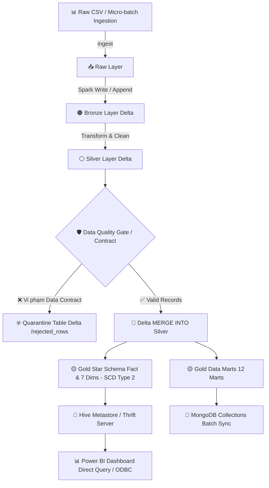

# 🌐 GlobalCart Intelligence

### 🚀 End-to-End Ecommerce Lakehouse, Incremental Pipeline & BI Platform

`Apache Spark` · `Delta Lake` · `Hadoop HDFS` · `Hive Metastore` · `MongoDB` · `Power BI` · `Python` · `Pytest`

Dự án **Data Engineering Enterprise-Grade** mô phỏng một **Nền tảng Dữ liệu & Phân tích Kinh doanh (Data Lakehouse, Incremental Pipeline & BI Serving)** cho thương mại điện tử toàn cầu. Hệ thống xử lý dữ liệu từ giao dịch batch & micro-batch, biến dữ liệu thô thành kiến trúc **Medallion Lakehouse (Bronze - Silver - Gold)** có **Data Quality Gate & Quarantine Table Delta**, mô hình dimensional **Kimball Star Schema (1 Fact, 7 Dimensions, SCD Type 2)** và **12 Data Marts**, bao gồm RFM và Pareto ABC theo quy tắc đồng nhất, phục vụ **Power BI** và **MongoDB**.

---

## 🏗️ Sơ Đồ Kiến Trúc Hệ Thống (System Architecture Overview)



| Tầng Lakehouse | Vai Trò & Nhiệm Vụ | Đường Dẫn Dữ Liệu |
|---|---|---|
| **Raw** | Lưu trữ file CSV thô và các micro-batch đầu vào | `Data/EcommerceSalesDataset.csv` |
| **Bronze** | Ingestion giữ nguyên bản gốc dạng Delta Lake, lưu vết Transaction Log (`_delta_log`) | `/ecommerce/bronze/ecommerce_raw_delta` |
| **Silver** | Ép kiểu, tính toán chỉ số, lọc vi phạm & MERGE INTO Delta table | `/ecommerce/silver/ecommerce_clean_delta` |
| **Quarantine** | Lưu trữ các bản ghi không đạt Data Contract kèm lý do vi phạm (`rejection_reason`) và thời gian | `/ecommerce/quarantine/rejected_rows` |
| **Gold Star** | Mô hình sao Kimball chi tiết (1 Fact, 7 Dimensions) hỗ trợ **SCD Type 2** | `/ecommerce/gold/star_schema/*` |
| **Gold Marts** | 12 Bảng tổng hợp báo cáo nhanh (Khu vực, Ngành hàng, RFM, ABC...) | `/ecommerce/gold/marts/*` |

---

## 🌟 Executive Summary

| Bài Toán Thực Tế | Giải Pháp Kỹ Thuật | Kết Quả Có Thể Kiểm Chứng |
|---|---|---|
| Dữ liệu bán hàng thô chứa bản ghi lỗi và mất tính toàn vẹn | **Medallion Lakehouse** & **Data Quality Gate / Quarantine Table** | Dữ liệu lỗi được cách ly vào `quarantine/rejected_rows` kèm lý do vi phạm |
| Nguy cơ trùng lặp số liệu Fact do thay đổi thuộc tính Customer | **Deduplication 1 Customer = 1 Record** & **SCD Type 2 Dimensions** | Loại bỏ hoàn toàn rủi ro nhân đôi doanh thu khi join dimension |
| Nhiều hệ thống (BI & NoSQL) dễ bị lệch số liệu khi truy vấn | **Gold Delta Tables** là nguồn dữ liệu chuẩn upstream duy nhất | Hive Thrift Server (Power BI) và MongoDB Batch Sync nạp từ chung nguồn Gold Delta |
| Cần xử lý dữ liệu nạp mới linh hoạt không cần re-run toàn bộ | **Incremental Pipeline** với **Delta MERGE INTO** | Hỗ trợ nạp micro-batch và upsert vào Silver Delta tables |
| Phân tích RFM/ABC bị lệch số liệu giữa các báo cáo | **Rule-Based Engine Tập Trung (`analytics_rules.py`)** | Contract test tự động xác nhận 100% đồng nhất phân hạng giữa Pandas và PySpark |
| Cần chứng minh khả năng mở rộng của PySpark pipeline | **Synthetic Scalability Benchmark (10K - 1M+ rows)** | Báo cáo chi tiết runtime, throughput, MB input/output trong `docs/BENCHMARK.md` |

---

## 💎 Các Giá Trị Kỹ Thuật Nổi Bật

1. **Nguồn Dữ Liệu Upstream Chuẩn Hóa (Single Source of Truth Upstream):** Gold Delta tables đóng vai trò là nguồn dữ liệu chuẩn upstream phục vụ đồng bộ batch sang MongoDB Collections và truy vấn qua Spark Hive Thrift Server kết nối Power BI.
2. **Data Quality Gate & Quarantine Table:** Phân lập các bản ghi lỗi (null bắt buộc, Quantity <= 0, Discount ngoài [0,1]) vào Delta table `/ecommerce/quarantine/rejected_rows` với `rejection_reason` và `rejected_at`.
3. **Mô Hình Hóa Dữ Liệu Kimball & SCD Type 2:** 1 Fact Table (`fact_sales` - grain: 1 dòng = 1 sản phẩm trong 1 đơn), 7 Dimension Tables hỗ trợ **SCD Type 2 (Slowly Changing Dimensions)** bảo toàn chính xác lịch sử thay đổi của khách hàng.
4. **Incremental Ingestion & Delta MERGE INTO:** Cho phép append micro-batch vào Bronze và MERGE INTO Silver/Gold mà không cần ghi đè toàn bộ dữ liệu.
5. **Scalability Benchmark (10K - 1M+ rows):** kịch bản thử nghiệm tải synthetic benchmark chứng minh throughput mở rộng tuyến tính.

---

## 🖼️ Power BI Dashboard & Visual Serving

Mô hình dữ liệu Gold Star Schema và 12 Gold Data Marts sẵn sàng phục vụ trực tiếp cho **Power BI Dashboard** (`BI_BIG .pbix`):


- **Exec Overview**: Tổng doanh thu, lợi nhuận ròng, biên lợi nhuận trung bình và số lượng đơn hàng.
- **RFM Customer Segmentation Matrix**: Phân lớp khách hàng *Champions, Loyal, At-Risk, Recent & Casual*.
- **Pareto ABC Product Matrix**: Tự động phân nhóm sản phẩm Class A (Top 80% Revenue), Class B (Next 15%), Class C (Tail 5%).

---

## 💼 Dành Cho Nhà Tuyển Dụng (Recruiters & Hiring Managers)

Tài liệu chi tiết cho đánh giá hồ sơ tuyển dụng được chuyển sang:
👉 **[Tài liệu Portfolio & STAR Story (docs/PORTFOLIO.md)](docs/PORTFOLIO.md)**

CÁC TÀI LIỆU CHUYÊN SÂU:
- 📈 **[Scalability Benchmark Report (docs/BENCHMARK.md)](docs/BENCHMARK.md)**
- 📘 **[Giải thích Kiến trúc & Quyết định Kỹ thuật (docs/ARCHITECTURE.md)](docs/ARCHITECTURE.md)**
- 📖 **[Data Dictionary & Định nghĩa KPI (docs/DATA_DICTIONARY.md)](docs/DATA_DICTIONARY.md)**
- 📊 **[Báo cáo Business Insights tự động (docs/BUSINESS_INSIGHTS.md)](docs/BUSINESS_INSIGHTS.md)**

---

## 🚀 Hướng Dẫn Vận Hành CLI (Command Line Operations)

Mọi tác vụ của hệ thống được quản lý thông qua **CLI thống nhất** `project_cli.py`:

```powershell
# 1. Chẩn đoán môi trường Python, Java, Hadoop HDFS
python SourceCode\project_cli.py doctor

# 2. Kiểm tra dữ liệu thô, sinh báo cáo và chạy toàn bộ Unit Tests
python SourceCode\project_cli.py check

# 3. Khởi chạy Spark Lakehouse Pipeline với SCD Type 2
python SourceCode\project_cli.py pipeline --local --scd2

# 4. Khởi chạy Scalability Benchmark (10K, 100K, 1M rows)
python SourceCode\project_cli.py benchmark

# 5. Đồng bộ các bảng Delta Lake sang MongoDB
python SourceCode\project_cli.py mongodb

# 6. Khởi động Spark Thrift Server kết nối Power BI
python SourceCode\project_cli.py thrift
```

---

## 🧪 Kiểm Thử Tự Động (Automated Testing)

Toàn bộ quy tắc chất lượng dữ liệu, công thức KPI, RFM Customer Segmentation, ABC Pareto Analysis và Contract Test được bảo đảm bằng bộ kiểm thử Pytest:

```powershell
python -m pytest -v --basetemp=./scratch/pytest_temp
```

---

## 🛡️ License & Contact

Dự án được phát triển dưới dạng **Portfolio Data Engineering**. Mọi đóng góp hoặc thắc mắc về mặt kỹ thuật xin vui lòng liên hệ tác giả.
