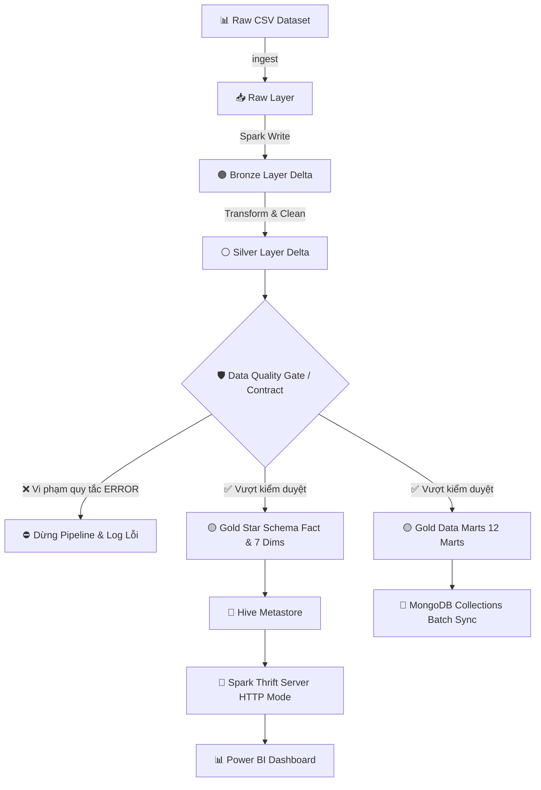

# 🌐 GlobalCart Intelligence

### 🚀 End-to-End Ecommerce Lakehouse & BI Portfolio Platform

`Apache Spark` · `Delta Lake` · `Hadoop HDFS` · `Hive Metastore` · `MongoDB` · `Power BI` · `Python` · `Pytest`

Dự án cá nhân mô phỏng một **Nền tảng Dữ liệu & Phân tích Kinh doanh (Data Lakehouse & BI Serving)** cho thương mại điện tử toàn cầu. Hệ thống xử lý **10.000 giao dịch, 26 thuộc tính**, biến dữ liệu thô thành kiến trúc **Medallion Lakehouse (Bronze - Silver - Gold)** có **Data Quality Gate / Data Contract**, mô hình dimensional **Kimball Star Schema (1 Fact, 7 Dimensions)** và **12 Data Marts**, bao gồm RFM và Pareto ABC theo quy tắc đồng nhất, phục vụ **Power BI** và **MongoDB**.

---

## 🌟 Executive Summary

| Bài Toán Thực Tế | Giải Pháp Kỹ Thuật | Kết Quả Có Thể Kiểm Chứng |
|---|---|---|
| Dữ liệu bán hàng thô, lặp lại và dễ mất tính toàn vẹn | Kiến trúc **Medallion Lakehouse** & **Data Quality Gate / Data Contract** tự động | Dataset mẫu 10.000 dòng vượt kiểm duyệt đầu vào; dữ liệu lỗi được ghi log/quarantine trước tầng Gold |
| Dashboard BI phải join/tính toán lại trên dữ liệu chi tiết | Mô hình **Kimball Star Schema** (1 Fact, 7 Dim) & **12 Data Marts** chuẩn hóa | Chuẩn bị sẵn dữ liệu phân tích; giảm thiểu tính toán trên Power BI |
| Nhiều hệ thống (BI & NoSQL) dễ bị lệch số liệu khi truy vấn | **Delta Lake** là Single Source of Truth duy nhất cho cả Hive Metastore & MongoDB | Hive Thrift Server (Power BI) và MongoDB Batch Sync cùng nạp từ dữ liệu Gold Delta Tables |
| Phân tích RFM/ABC bị lệch số liệu giữa các báo cáo | **Rule-Based Engine Tập Trung (`analytics_rules.py`)** dùng chung cho cả Pandas & Spark | Contract test tự động xác nhận 100% đồng nhất phân hạng giữa Pandas và PySpark |
| Pipeline khó chạy trên máy không có HDFS cluster | Thiết kế **Hybrid Storage Mode** (Local File Storage & HDFS Cluster) | Có chế độ local offline; hỗ trợ PySpark, Delta Lake và integration test |

> 📌 **Ghi chú Portfolio:** Dự án áp dụng Clean Code, type annotations, modular Lakehouse package (`SourceCode/lakehouse/`), chú thích tiếng Việt và kiểm thử tự động Pytest.

---

## 💎 Các Giá Trị Kỹ Thuật Nổi Bật

1. **Một Nguồn Dữ Liệu Thống Nhất (Single Source of Truth):** MongoDB và Power BI cùng truy vấn trực tiếp từ kết quả Delta Lakehouse, triệt tiêu nguy cơ bất nhất số liệu.
2. **Xử Lý An Toàn Idempotent (Retry/Overwrite Safety):** Hỗ trợ cơ chế overwrite an toàn dựa trên Transaction Log của Delta Lake (`_delta_log`), không lo nhân đôi dữ liệu khi re-run pipeline.
3. **Data Quality Gate & Data Contract:** Tự động kiểm tra các quy tắc nghiêm ngặt (Order_ID không null, Quantity > 0, Unit_Price >= 0, Discount trong [0,1], Revenue formula consistency).
4. **Mô Hình Hóa Dữ Liệu Kimball:** Thiết kế 1 Fact Table (`fact_sales` - grain: 1 dòng = 1 sản phẩm trong 1 đơn), 7 Dimension Tables (`dim_product`, `dim_customer`, `dim_location`, `dim_payment`, `dim_shipping`, `dim_order_status`, `dim_date`).
5. **Analytics Engine Đồng Nhất:**
   - **RFM Customer Segmentation:** Phân hạng khách hàng (*Champions, Loyal, At-Risk, Recent & Casual*) phục vụ Marketing.
   - **Pareto ABC Analysis:** Phân loại sản phẩm (*Class A: Top 80% doanh thu tích lũy, Class B: Next 15%, Class C: Tail 5%*) phục vụ quản trị kho.
6. **Cấu Hình Môi Trường Linh Hoạt:** Toàn bộ thông số quản lý bằng biến môi trường qua `SourceCode/config.py`, không hardcode đường dẫn máy cá nhân.

---

## 📊 Dành Cho Nhà Tuyển Dụng (Recruiter & Technical Hiring Manager)

- 📘 **[Giải thích Kiến trúc & Quyết định Kỹ thuật](docs/ARCHITECTURE.md)**
- 📖 **[Data Dictionary & Định nghĩa KPI](docs/DATA_DICTIONARY.md)**
- 📈 **[Báo cáo Business Insights tự động](docs/BUSINESS_INSIGHTS.md)**
- 💼 **[CV Bullets Song Ngữ (Việt - Anh) & Câu chuyện Phỏng vấn STAR](docs/CV_PORTFOLIO.md)**

### 🎯 Các Năng Lực Được Thể Hiện Trong Dự Án:
`Data Ingestion` · `Distributed ETL Pipeline` · `Medallion Lakehouse Design` · `Kimball Dimensional Modeling` · `Data Quality Control` · `Rule-based Analytics (RFM/ABC)` · `NoSQL Serving (MongoDB)` · `BI Integration (Power BI ODBC)` · `Unit & Contract Testing (Pytest)` · `CLI Tooling` · `Technical Documentation`

---

## 🏗️ Sơ Đồ Kiến Trúc Hệ Thống (Architecture Overview)



| Tầng Lakehouse | Vai Trò & Nhiệm Vụ | Đường Dẫn Dữ Liệu |
|---|---|---|
| **Raw** | Lưu trữ file CSV gốc nguyên bản | `Data/EcommerceSalesDataset.csv` |
| **Bronze** | Sao chép dữ liệu thô dạng Delta Lake, giữ lại `_delta_log` | `/ecommerce/bronze/ecommerce_raw_delta` |
| **Silver** | Chuẩn hóa kiểu dữ liệu, lọc rỗng/trùng, tính toán các trường chỉ số | `/ecommerce/silver/ecommerce_clean_delta` |
| **Gold Star** | Mô hình sao Kimball chi tiết (1 Fact, 7 Dimensions) | `/ecommerce/gold/star_schema/*` |
| **Gold Marts** | 12 Bảng tổng hợp báo cáo nhanh (Khu vực, Ngành hàng, RFM, ABC...) | `/ecommerce/gold/marts/*` |

---

## 📂 Cấu Trúc Thư Mục Dự Án (Project Structure)

```text
GlobalEcommerceBigData/
├── Data/                          # Thư mục chứa dữ liệu CSV thô
│   └── EcommerceSalesDataset.csv  # Dataset mẫu 10,000 dòng giao dịch
├── SourceCode/                    # Mã nguồn chính của dự án (100% chú thích Tiếng Việt)
│   ├── project_cli.py             # 🌟 CLI Entry Point điều phối hệ thống
│   ├── config.py                  # Cấu hình tập trung & Local/HDFS Hybrid Mode
│   ├── analytics_rules.py         # 🌟 Engine tập trung định nghĩa quy tắc RFM & ABC
│   ├── environment_check.py       # Công cụ kiểm tra môi trường (Doctor)
│   ├── data_quality.py            # Định nghĩa các quy tắc Quality Gate & Data Contract
│   ├── portfolio_metrics.py       # Engine tính KPI tổng quan (Pandas)
│   ├── validate_input.py          # Kiểm tra file CSV thô không cần Spark
│   ├── generate_portfolio_report.py # Tự động sinh file docs/BUSINESS_INSIGHTS.md
│   ├── SparkEcommerceAnalysis.py  # Wrapper tương thích ngược khởi chạy Lakehouse Pipeline
│   ├── InsertMongoDB.py           # Đồng bộ Delta Lake sang MongoDB
│   ├── start_thrift_server.py     # Khởi động Hive Thrift Server cho Power BI
│   └── lakehouse/                 # 📦 Package PySpark Medallion Lakehouse Modular
│       ├── __init__.py
│       ├── ingestion.py           # Nạp dữ liệu thô và validate schema
│       ├── silver.py              # Làm sạch, ép kiểu, Quality Gate tầng Silver
│       ├── dimensions.py          # Sinh 7 bảng Dimension Kimball Star Schema
│       ├── marts.py               # Sinh FactSales và 12 Gold Data Marts
│       ├── storage.py             # Delta Lake I/O & Hive Metastore registration
│       └── pipeline.py            # Main Orchestration điều phối Spark Pipeline
├── tests/                         # Thư mục kiểm thử tự động Pytest
│   ├── test_analytics_contract.py # Contract test kiểm tra đồng nhất Pandas vs Spark RFM/ABC
│   ├── test_edge_cases.py         # Test các trường hợp biên (empty, negative, null, ties)
│   ├── test_data_quality.py       # Test kiểm duyệt dữ liệu Data Quality Gate
│   ├── test_portfolio_metrics.py  # Test công thức KPI
│   ├── test_advanced_analytics.py # Test mô hình RFM & ABC Analysis
│   ├── test_environment_check.py  # Test kiểm tra môi trường
│   └── test_project_cli.py        # Test bộ điều hướng CLI
├── docs/                          # Tài liệu kỹ thuật chi tiết
│   ├── ARCHITECTURE.md            # Thiết kế kiến trúc & Quyết định kỹ thuật
│   ├── DATA_DICTIONARY.md         # Từ điển dữ liệu & Định nghĩa KPI
│   ├── BUSINESS_INSIGHTS.md       # Báo cáo kinh doanh sinh tự động
│   └── CV_PORTFOLIO.md            # CV Bullets song ngữ & STAR Story
├── EcommerceDW.sql                # SQL DDL script cho SQL Server Data Warehouse
├── BI_BIG .pbix                   # Dashboard Power BI tham khảo
├── requirements.txt               # Các thư viện Python phụ thuộc
├── pyproject.toml                 # Cấu hình Pytest & Ruff Lint
└── README.md                      # Tài liệu tổng quan dự án
```

---

## ⚡ Hướng Dẫn Cài Đặt & Chạy Nhanh (Quick Start)

### 1. Khởi Tạo Môi Trường Python

Mở PowerShell tại thư mục gốc của dự án:

```powershell
# Tạo môi trường ảo Python
python -m venv .venv
.\.venv\Scripts\Activate.ps1

# Nâng cấp pip và cài đặt thư viện
python -m pip install --upgrade pip
python -m pip install -r requirements.txt
```

### 2. Kiểm Tra Chẩn Đoán Môi Trường (`doctor`)

Khởi chạy lệnh chẩn đoán hệ thống:

```powershell
python SourceCode\project_cli.py doctor
```

---

## 🚀 Hướng Dẫn Vận Hành CLI (Command Line Operations)

Mọi tác vụ của hệ thống được quản lý thông qua **CLI thống nhất** `project_cli.py`:

```powershell
# 1. Kiểm tra dữ liệu thô, sinh báo cáo và chạy toàn bộ Unit Tests
python SourceCode\project_cli.py check

# 2. Sinh lại báo cáo Business Insights tự động
python SourceCode\project_cli.py report

# 3A. Khởi chạy Spark Lakehouse Pipeline ở chế độ Local Offline (Không cần Hadoop Cluster)
python SourceCode\project_cli.py pipeline --local

# 3B. Khởi chạy Spark Lakehouse Pipeline trên cụm Hadoop HDFS
python SourceCode\project_cli.py pipeline

# 4. Đồng bộ các bảng Delta Lake sang MongoDB
python SourceCode\project_cli.py mongodb

# 5. Khởi động Spark Thrift Server kết nối Power BI
python SourceCode\project_cli.py thrift
```

---

## 🧪 Kiểm Thử Tự Động (Automated Testing)

Toàn bộ quy tắc chất lượng dữ liệu, công thức KPI, RFM Customer Segmentation, ABC Pareto Analysis và Contract Test được bảo đảm bằng bộ kiểm thử Pytest:

```powershell
python -m pytest -v --basetemp=./scratch/pytest_temp
```

---

## 📈 Phân Tích Kỹ Thuật Nâng Cao (Advanced Analytics)

### 1. Phân Hạng Khách Hàng RFM (Recency, Frequency, Monetary)
- **Champions:** Khách hàng mua gần đây (R <= 30 ngày), tần suất cao (F >= 3 đơn).
- **Loyal Customers:** Khách hàng mua hàng thường xuyên (F >= 3 đơn).
- **At-Risk Customers:** Khách hàng lâu chưa quay lại mua (R > 90 ngày).
- **Recent & Casual Customers:** Khách hàng mới / mua vãng lai.

### 2. Phân Loại Sản Phẩm Pareto ABC Analysis
- **Class A (Top 80% Revenue):** Sản phẩm đóng góp vào 80% doanh thu tích lũy ban đầu.
- **Class B (Next 15% Revenue):** Sản phẩm đóng góp 15% doanh thu tích lũy tiếp theo.
- **Class C (Tail 5% Revenue):** Các sản phẩm thuộc 5% doanh thu còn lại.

---

## 📝 CV Highlights (Nội Dung Đưa Vào CV)

### CV Bullet Points (Tiếng Việt)
- **Mô phỏng kiến trúc Medallion Data Lakehouse** (Bronze - Silver - Gold) xử lý **10.000 giao dịch** bằng **PySpark, Delta Lake và HDFS**; tích hợp **Data Quality Gate / Data Contract** tự động loại bỏ hoặc cảnh báo bản ghi lỗi.
- **Xây dựng mô hình sao Kimball** (1 Fact, 7 Dimensions) và **12 Data Marts chuyên sâu** (bao gồm **RFM Customer Segmentation** & **Pareto ABC Analysis** theo quy tắc thống nhất) cho Power BI và MongoDB.
- **Cải thiện khả năng bảo trì codebase**: Hỗ trợ Local/HDFS Hybrid Mode, idempotency, package modular `SourceCode/lakehouse/`, cấu hình môi trường tập trung và bộ kiểm thử tự động Pytest.

### CV Bullet Points (English)
- **Engineered a Medallion Data Lakehouse** (Bronze, Silver, Gold) processing **10K transactions** using **PySpark, Delta Lake, and HDFS** with automated Data Quality Gates.
- **Built a Kimball Star Schema** (1 Fact, 7 Dimensions) and **12 Data Marts** including **RFM Customer Segmentation** and **Pareto ABC Product Analysis** serving Power BI and MongoDB via unified rules.
- **Developed a maintainable Python data platform** featuring Local/HDFS hybrid execution, environment configuration, idempotent Delta ingestion, and automated Pytest test suite.

---

## ⚠️ Hạn Chế Hiện Tại (Limitations & Portfolio Scope)

- Dataset mẫu quy mô 10.000 dòng batch; chưa áp dụng Streaming/CDC.
- RFM và Pareto ABC là **rule-based analytics**, không phải mô hình Machine Learning.
- Chưa thực hiện load test concurrent users hoặc benchmark cụm cluster thực tế.
- Derby Metastore và Spark Thrift Server local chỉ phục vụ môi trường demo portfolio.
- Integration test đầy đủ yêu cầu PySpark, Delta Lake, HDFS và MongoDB hoạt động.

---

## 🛡️ License & Contact

Dự án được phát triển dưới dạng **Portfolio Cá Nhân**. Mọi đóng góp hoặc thắc mắc về mặt kỹ thuật xin vui lòng mở Issue hoặc liên hệ tác giả.
